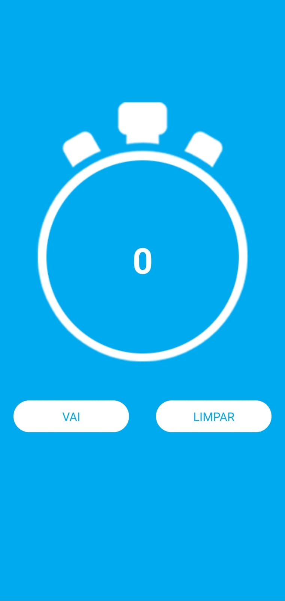
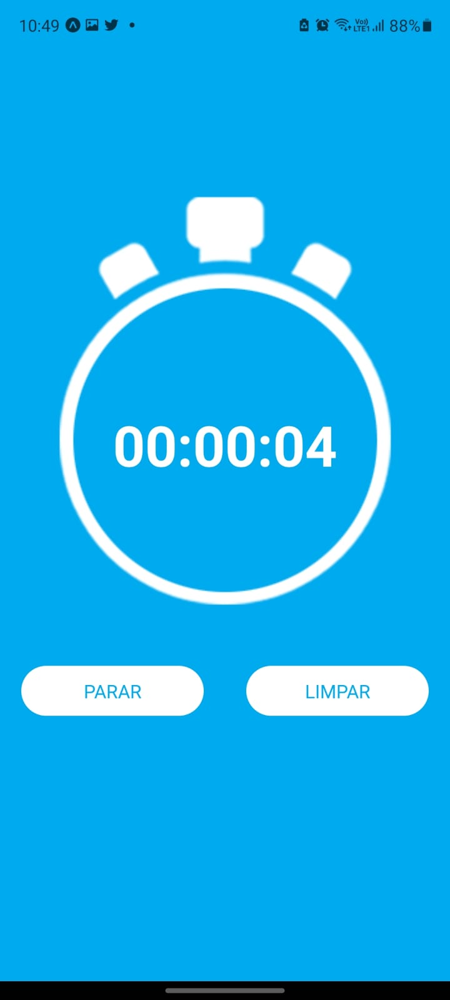
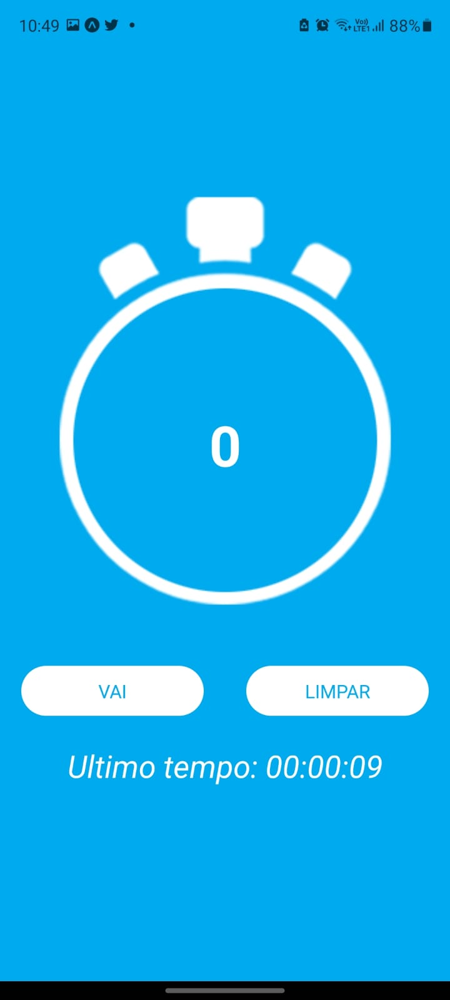

<h1>Cronometro</h1>

<!-- LINKS -->

 
 <h2> Sumário</h2>
 
 <a href="#fotos">Fotos</a> - 
  <a href="#sobre">Sobre o Projeto</a> - 
  <a href="#tec">Tecnologias</a>

 

<!-- FOTOS -->

    <h2> 📸 Fotos </h2>
        
        
        
       
  

<!-- SOBRE -->

    <h2> 📝 Sobre o Projeto </h2> 
    
 Um aplicativo de cronometro feito com ReactNative, para fixar conhecimentos. Clicando em "Vai", o cronometro inicia, e pode ser parado a qualquer momento. Quando clicamos em "Limpar" o cronometro reinicia, e em baixo aparece o ultimo tempo registrado, assim como nas fotos 

 

<!-- TECNOLOGIAS -->

<h2> 🖥️ Tecnologias</h2>
    
 ✔️JavaScript

    
 ✔️ React Native

